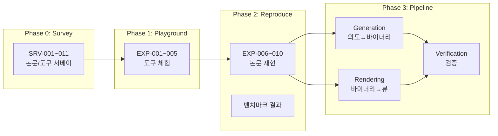

# Binary Alchemy - Master Hub

## Project Pipeline



## Survey Notes (SRV)

### Generation (AI → Binary)

| ID | 대상 | 핵심 수치 | Status |
|----|------|----------|--------|
| [[SRV-001_nova]] | NOVA (ICLR 2025) | 1.3B, 계층적 어텐션 | 작성 예정 |
| [[SRV-002_supercoder]] | SuperCoder (2025) | 95% 정확도, 1.46x speedup | 작성 예정 |
| [[SRV-003_llm-compiler]] | Meta LLM Compiler | 546B 토큰, 7B/13B | 작성 예정 |

### Rendering (Binary → Human)

| ID | 대상 | 핵심 수치 | Status |
|----|------|----------|--------|
| [[SRV-004_llm4decompile]] | LLM4Decompile | 64.94% 재실행성 | 작성 예정 |
| [[SRV-005_sk2decompile]] | SK²Decompile | +21.6% 개선 | 작성 예정 |
| [[SRV-006_clap]] | CLAP (ISSTA 2024) | 195M 쌍, 대조 학습 | 작성 예정 |
| [[SRV-007_ghidrassist]] | GhidrAssist + DAILA | Ghidra AI 플러그인 | 작성 예정 |

### Verification

| ID | 대상 | 핵심 수치 | Status |
|----|------|----------|--------|
| [[SRV-008_formai]] | FormAI Dataset | 112K 프로그램 | 작성 예정 |
| [[SRV-009_metamorphic-testing]] | Metamorphic Testing | 75% 탐지율 | 작성 예정 |
| [[SRV-010_formal-verification]] | Formal Verification | Dafny, Lean, Verus | 작성 예정 |
| [[SRV-011_ai-bom]] | AI-BOM (OWASP) | 투명성 표준 | 작성 예정 |

## Experiments (EXP)

### Phase 1: Playground

| ID | 실험 | 도구 | Status |
|----|------|------|--------|
| - | Nova 모델 추론 | Nova 1.3B, HuggingFace | 예정 |
| - | LLM4Decompile 실습 | LLM4Decompile V2 | 예정 |
| - | Ghidra + AI | GhidrAssist | 예정 |
| - | CLAP 임베딩 | CLAP | 예정 |
| - | Claude 어셈블리 생성 | Claude API | 예정 |

## Design Documents

| 문서 | 설명 | Status |
|------|------|--------|
| [[architecture]] | 전체 시스템 아키텍처 | 초안 예정 |
| [[generation-pipeline]] | 생성 파이프라인 설계 | Phase 2 후 |
| [[rendering-pipeline]] | 렌더링 파이프라인 설계 | Phase 2 후 |

## Technology Landscape

```
                    ┌─────────────────────────────────────┐
                    │        현재 기술 지형도              │
                    ├─────────────────────────────────────┤
 실현됨              │  연구 중                │ 미래 비전  │
 (Production)       │  (Research)             │ (Vision)   │
                    │                         │            │
 AI→Python/JS       │  AI→어셈블리            │ AI→기계어  │
 (Copilot,Claude)   │  (Nova,SuperCoder)      │ (직접)     │
                    │                         │            │
 바이너리 분석       │  AI 디컴파일            │ 실시간     │
 (Ghidra,IDA)       │  (LLM4Decompile)        │ 렌더링     │
                    │                         │            │
 단위 테스트         │  Metamorphic Test       │ AI가 AI를  │
                    │  Formal Verification    │ 검증       │
                    └─────────────────────────────────────┘
```

## Related

### 외부 프로젝트
- [k-chat](file:///C:/Users/kimgo/WorkSpace/k-chat) — Rust 학습 프로젝트 (Phase 4 진입 조건)

### 이 문서를 참조하는 노트
```dataview
LIST FROM "docs"
WHERE contains(file.outlinks, this.file.link)
```
